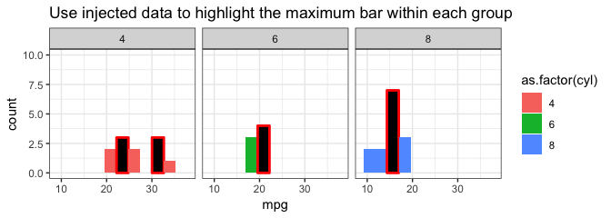

<!-- README.md is generated from README.Rmd. Please edit that file -->

# ggdebug

<!-- badges: start -->


<!-- badges: end -->

`ggdebug` is a package for debugging ggplot2 stats.

I created this package to help in developing new `ggplot2` stats, and
trying to decipher and understand how existing ones work.

What’s in the box:

  - `create_stat_with_caching()`
      - **Capture arguments and the return values internal to Stat
        methods**
  - `inject_data_into_stat_function()`
      - **Inject arguments and return values directly into Stat
        methods**

This package wouldn’t be possible without:

  - [ggplot2](https://cran.r-project.org/package=ggplot2) by Hadley
    Wickham
  - [Brodie Gaslam’s](https://twitter.com/BrodieGaslam) great guide to
    [ggplot2
    internals](https://htmlpreview.github.io/?https://github.com/brodieG/ggbg/blob/development/inst/doc/extensions.html#stat-compute)
  - [boBRudis’s](https://twitter.com/hrbrmstr) post on [demystifying
    ggplot2](https://rud.is/books/creating-ggplot2-extensions/demystifying-ggplot2.html)

## Installation

You can install the development version from
[GitHub](https://github.com/coolbutuseless/ggdebug) with:

``` r
# install.packages("remotes")
remotes::install_github("coolbutuseless/ggdebug")
```

## Debug `geom_histogram` + `StatBin`

The following example shows how `ggdebug` can be used to capture the
data during creation of `geom_histogram()`.

`geom_histogram()` uses a default Stat of `StatBin`. Instead we create a
debugging version of this Stat and use it explicitly.

The captured data is available by calling
`ggdebug::get_cache_data()`.

``` r
#~~~~~~~~~~~~~~~~~~~~~~~~~~~~~~~~~~~~~~~~~~~~~~~~~~~~~~~~~~~~~~~~~~~~~~~~~~~~~~
# Create a new stat which is identical to StatBin, but captures the
# data for all the methods.
#~~~~~~~~~~~~~~~~~~~~~~~~~~~~~~~~~~~~~~~~~~~~~~~~~~~~~~~~~~~~~~~~~~~~~~~~~~~~~~
StatBinDebug <- ggdebug::create_stat_with_caching(
  StatBin
)
```

``` r
#~~~~~~~~~~~~~~~~~~~~~~~~~~~~~~~~~~~~~~~~~~~~~~~~~~~~~~~~~~~~~~~~~~~~~~~~~~~~~~
# Create the plot using the new Stat
#~~~~~~~~~~~~~~~~~~~~~~~~~~~~~~~~~~~~~~~~~~~~~~~~~~~~~~~~~~~~~~~~~~~~~~~~~~~~~~
ggplot(mtcars) +
  geom_histogram(aes(mpg, fill = as.factor(cyl)), stat = StatBinDebug, bins = 10) +
  theme_bw() +
  facet_wrap(~cyl)
```


``` r

#~~~~~~~~~~~~~~~~~~~~~~~~~~~~~~~~~~~~~~~~~~~~~~~~~~~~~~~~~~~~~~~~~~~~~~~~~~~~~~
# Get the data we captured from this process
#~~~~~~~~~~~~~~~~~~~~~~~~~~~~~~~~~~~~~~~~~~~~~~~~~~~~~~~~~~~~~~~~~~~~~~~~~~~~~~
cdata <- ggdebug::get_data_cache()

#~~~~~~~~~~~~~~~~~~~~~~~~~~~~~~~~~~~~~~~~~~~~~~~~~~~~~~~~~~~~~~~~~~~~~~~~~~~~~~
# Interrogate the captured data. 
# Each method has its only entry in the data cache, and 
# within each entry there are both the `args` and the `return` value
# for this method
#~~~~~~~~~~~~~~~~~~~~~~~~~~~~~~~~~~~~~~~~~~~~~~~~~~~~~~~~~~~~~~~~~~~~~~~~~~~~~~
names(cdata)
#> [1] "parameters"    "compute_group" "compute_panel" "compute_layer"
#> [5] "finish_layer"

#~~~~~~~~~~~~~~~~~~~~~~~~~~~~~~~~~~~~~~~~~~~~~~~~~~~~~~~~~~~~~~~~~~~~~~~~~~~~~~
# arguments and the return value for the 'parameters()' method
#~~~~~~~~~~~~~~~~~~~~~~~~~~~~~~~~~~~~~~~~~~~~~~~~~~~~~~~~~~~~~~~~~~~~~~~~~~~~~~
cdata$parameters
#> $args
#> $args$extra
#> [1] FALSE
#> 
#> 
#> $return
#>  [1] "binwidth" "bins"     "center"   "boundary" "closed"   "pad"     
#>  [7] "breaks"   "origin"   "right"    "drop"     "width"

#~~~~~~~~~~~~~~~~~~~~~~~~~~~~~~~~~~~~~~~~~~~~~~~~~~~~~~~~~~~~~~~~~~~~~~~~~~~~~~
# The 'data' argument passed in to the 'compute_layer()' method
#~~~~~~~~~~~~~~~~~~~~~~~~~~~~~~~~~~~~~~~~~~~~~~~~~~~~~~~~~~~~~~~~~~~~~~~~~~~~~~
head(cdata$compute_layer$args$data)
#>      x fill PANEL group
#> 1 21.0    6     2     2
#> 2 21.0    6     2     2
#> 3 22.8    4     1     1
#> 4 21.4    6     2     2
#> 5 18.7    8     3     3
#> 6 18.1    6     2     2

#~~~~~~~~~~~~~~~~~~~~~~~~~~~~~~~~~~~~~~~~~~~~~~~~~~~~~~~~~~~~~~~~~~~~~~~~~~~~~~
# The return value from the 'finish_layer()' method
#~~~~~~~~~~~~~~~~~~~~~~~~~~~~~~~~~~~~~~~~~~~~~~~~~~~~~~~~~~~~~~~~~~~~~~~~~~~~~~
head(cdata$finish_layer$return)
#>      fill y count        x      xmin     xmax   density    ncount
#> 1 #F8766D 0     0 10.44444  9.138889 11.75000 0.0000000 0.0000000
#> 2 #F8766D 0     0 13.05556 11.750000 14.36111 0.0000000 0.0000000
#> 3 #F8766D 0     0 15.66667 14.361111 16.97222 0.0000000 0.0000000
#> 4 #F8766D 0     0 18.27778 16.972222 19.58333 0.0000000 0.0000000
#> 5 #F8766D 2     2 20.88889 19.583333 22.19444 0.0696325 0.6666667
#> 6 #F8766D 3     3 23.50000 22.194444 24.80556 0.1044487 1.0000000
#>    ndensity PANEL group ymin ymax colour size linetype alpha
#> 1 0.0000000     1     1    0    0     NA  0.5        1    NA
#> 2 0.0000000     1     1    0    0     NA  0.5        1    NA
#> 3 0.0000000     1     1    0    0     NA  0.5        1    NA
#> 4 0.0000000     1     1    0    0     NA  0.5        1    NA
#> 5 0.6666667     1     1    0    2     NA  0.5        1    NA
#> 6 1.0000000     1     1    0    3     NA  0.5        1    NA
```

## Inject data into `geom_histogram` + `StatBin`

`ggdebug` also allows you to inject arguments and override return values
within methods inside a Stat.

In this example, we take the above histogram, and at the last stage
(`finish_layer`) we inject a modified return value to override the real
one.

``` r
#~~~~~~~~~~~~~~~~~~~~~~~~~~~~~~~~~~~~~~~~~~~~~~~~~~~~~~~~~~~~~~~~~~~~~~~~~~~~~~
# From the above debugging example, grab the return value from `finish_layer`
#~~~~~~~~~~~~~~~~~~~~~~~~~~~~~~~~~~~~~~~~~~~~~~~~~~~~~~~~~~~~~~~~~~~~~~~~~~~~~~
finish_layer_return_value <- cdata$finish_layer$return

#~~~~~~~~~~~~~~~~~~~~~~~~~~~~~~~~~~~~~~~~~~~~~~~~~~~~~~~~~~~~~~~~~~~~~~~~~~~~~~
# Change the visual properties for the bar with the greatest height
#~~~~~~~~~~~~~~~~~~~~~~~~~~~~~~~~~~~~~~~~~~~~~~~~~~~~~~~~~~~~~~~~~~~~~~~~~~~~~~
finish_layer_return_value <- finish_layer_return_value %>% 
  group_by(group) %>%
  mutate(
    fill   = ifelse(count == max(count), '#000000', fill  ),
    colour = ifelse(count == max(count), '#ff0000', colour),
    size   = ifelse(count == max(count), 1        , size  )
  ) %>%
  ungroup()

#~~~~~~~~~~~~~~~~~~~~~~~~~~~~~~~~~~~~~~~~~~~~~~~~~~~~~~~~~~~~~~~~~~~~~~~~~~~~~~
# Create a modified version of StatBin which only returns our version of the 
# dataset from `finishlayer`
#~~~~~~~~~~~~~~~~~~~~~~~~~~~~~~~~~~~~~~~~~~~~~~~~~~~~~~~~~~~~~~~~~~~~~~~~~~~~~~
StatBinInject <- inject_data_into_stat_function(
  StatBin, 'finish_layer',
  return_value = finish_layer_return_value
)

#~~~~~~~~~~~~~~~~~~~~~~~~~~~~~~~~~~~~~~~~~~~~~~~~~~~~~~~~~~~~~~~~~~~~~~~~~~~~~~
# Recreate the plot using the injected data as the return from `finish_layer`
#~~~~~~~~~~~~~~~~~~~~~~~~~~~~~~~~~~~~~~~~~~~~~~~~~~~~~~~~~~~~~~~~~~~~~~~~~~~~~~
ggplot(mtcars) +
  geom_histogram(aes(mpg, fill = as.factor(cyl)), stat = StatBinInject, bins = 5) +
  theme_bw() +
  facet_wrap(~cyl) +
  labs(title = "Use injected data to highlight the maximum bar within each group")
```


## Inject tetris pieces into `geom_histogram` + `StatBin`

``` r
#~~~~~~~~~~~~~~~~~~~~~~~~~~~~~~~~~~~~~~~~~~~~~~~~~~~~~~~~~~~~~~~~~~~~~~~~~~~~~~
# Create 3 tetris pieces
#~~~~~~~~~~~~~~~~~~~~~~~~~~~~~~~~~~~~~~~~~~~~~~~~~~~~~~~~~~~~~~~~~~~~~~~~~~~~~~
tetris <- tribble(
  ~fill    , ~xmin, ~xmax, ~ymin, ~ymax,
  '#ff0000', 10, 19, 6, 7,
  '#ff0000', 13, 16, 6, 8,
  '#00ff00', 25, 28, 6, 8,
  '#00ff00', 28, 31, 7, 9,
  '#0000ff', 25, 34, 6, 7,
  '#0000ff', 28, 31, 6, 8
)

#~~~~~~~~~~~~~~~~~~~~~~~~~~~~~~~~~~~~~~~~~~~~~~~~~~~~~~~~~~~~~~~~~~~~~~~~~~~~~~
# Assign each piece to a different panel
#~~~~~~~~~~~~~~~~~~~~~~~~~~~~~~~~~~~~~~~~~~~~~~~~~~~~~~~~~~~~~~~~~~~~~~~~~~~~~~
tetris <- tetris %>% mutate(
  PANEL    = factor(c(1, 1, 2, 2, 3, 3), levels = 1:3), 
  group    = 1,
  linetype = 1,
  x        = xmax,
  y        = ymax
)

#~~~~~~~~~~~~~~~~~~~~~~~~~~~~~~~~~~~~~~~~~~~~~~~~~~~~~~~~~~~~~~~~~~~~~~~~~~~~~~
# Add the tetris data to the original data returned by `finish_layer`
#~~~~~~~~~~~~~~~~~~~~~~~~~~~~~~~~~~~~~~~~~~~~~~~~~~~~~~~~~~~~~~~~~~~~~~~~~~~~~~
finish_layer_return_value <- bind_rows(
  tetris, 
  cdata$finish_layer$return
)

#~~~~~~~~~~~~~~~~~~~~~~~~~~~~~~~~~~~~~~~~~~~~~~~~~~~~~~~~~~~~~~~~~~~~~~~~~~~~~~
# Create a StatBin that only returns this modified data from `finish_layer`
#~~~~~~~~~~~~~~~~~~~~~~~~~~~~~~~~~~~~~~~~~~~~~~~~~~~~~~~~~~~~~~~~~~~~~~~~~~~~~~
StatBinInject <- inject_data_into_stat_function(
  StatBin, 'finish_layer',
  return_value = finish_layer_return_value
)

#~~~~~~~~~~~~~~~~~~~~~~~~~~~~~~~~~~~~~~~~~~~~~~~~~~~~~~~~~~~~~~~~~~~~~~~~~~~~~~
# Create the plot to generate tetris pieces injected into the data
#~~~~~~~~~~~~~~~~~~~~~~~~~~~~~~~~~~~~~~~~~~~~~~~~~~~~~~~~~~~~~~~~~~~~~~~~~~~~~~
ggplot(mtcars) +
  geom_histogram(aes(mpg, fill = as.factor(cyl)), stat = StatBinInject, bins = 5) +
  theme_bw() +
  facet_wrap(~cyl) +
  labs(title = "Use injected data to inject tetris pieces")
```


